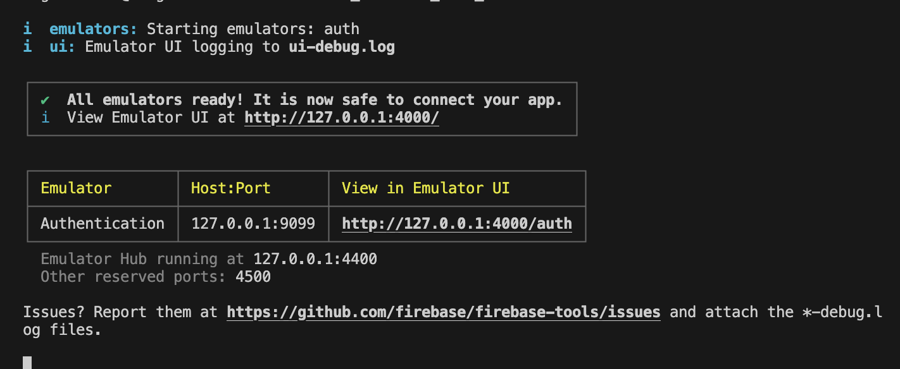

# Flutter Firebase Auth

A Flutter demo project with Firebase Authentication integration.

## Getting Started

### Prerequisite
This project includes multiple tools that enhance the developer experience by providing command-line interfaces (CLIs) to set up the Firebase project, generate files, and create shortcut scripts. It is mandatory to use these tools to replicate the same setup that was used when developing this project.

### Tools

**[Firebase CLI](https://firebase.google.com/docs/cli)**

Firebase offers tools for managing, viewing, and deploying projects. This project uses the Firebase CLI to create a Firebase Emulator for testing Firebase Auth without communicating with the server. 

To install the Firebase CLI, execute the command: `curl -sL https://firebase.tools | bash`.

**[FlutterFire](https://firebase.flutter.dev/docs/cli/)**

The [FlutterFire](https://firebase.flutter.dev/docs/overview) is a set of plugins which connect your application to Firebase. FlutterFire provides a CLI through FlutterFireCLI, which is a useful tool which provides commands to help ease the installation process of FlutterFire across all supported platforms. 

To install the FlutterFire CLI, execute the command: `dart pub global activate flutterfire_cli`.

**lcov**

The lcov CLI is used to generate HTML files based on lcov.info, which can be helpful in creating visual representations of test coverage.

To install the lcov CLI, execute the command: `brew install lcov`. 

**[Derry](https://pub.dev/packages/derry)**

Derry is a script manager created for Dart. This helps creating a more managable and readable command.

To install the Derry CLI, execute the command: `dart pub global activate derry`.

### Firebase Project Setup
After completing the set up of prerequisite tools, our next step to initialize the Firebase project within our project. 
**Step 1: Initalize Firebase Project through Firebase CLI**
1. Begin by executing the command: firebase init.
2. When prompted to select the Firebase feature to set up in the project, choose the Emulator option and press Enter to proceed.
3. The Firebase CLI will request the Firebase project to be used; select the project you intend to use for this demo.
4. After project selection, Firebase will inquire about which Firebase Emulators to set up; opt for the Authentication Emulator and continue.
5. You'll have the option to set a port for the Authentication Emulator, or you can leave it blank to use the default port.
   - Take note of the port you selected, as this will be used to instruct Firebase to utilize the Authentication Emulator.
6. Following the port configuration, Firebase will ask if you want to enable the Emulator UI. Type 'y' and press Enter, then specify the port for the Emulator UI. Enabling this feature allows you to access the Emulator page.
7. Firebase will inquire if you'd like to download the emulators; type 'Y' and press 
  
You can check the Firebase Emulator by executing the command: firebase emulator:start. You will see an output similar to the image below:

**Step 2: Generate Firebase Project Configuration File through FlutterFire**
1. Execute the command: flutterfire configure.
2. Choose the Firebase project you wish to use for this demo.
Upon completing this step, files related to Firebase project configuration will be generated.
