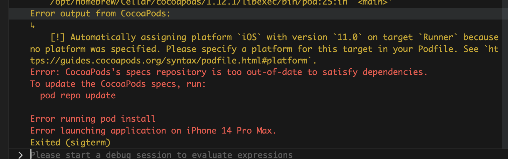

# Troubleshotting

This document provides troubleshooting to issues that you might encountering within the project.

### Error: CocoaPods's specs repository is too out-of-date to satisfy dependencies.
This error is usually encounter when the Pod depencies is not updated. The fix for this issue is to execute the Pod update command: `pod repo update`.

